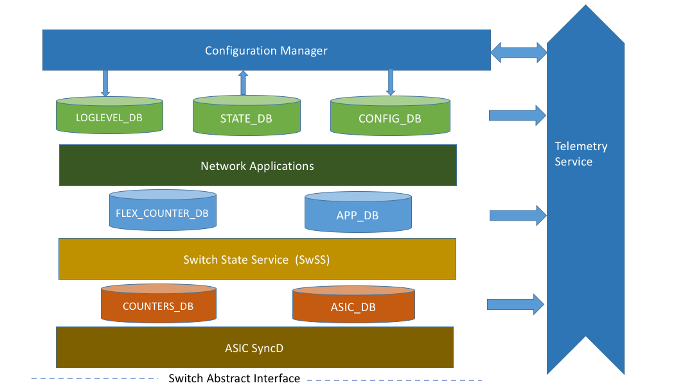
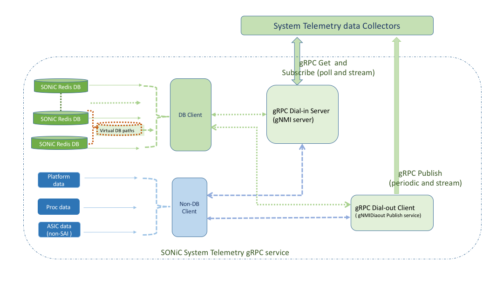
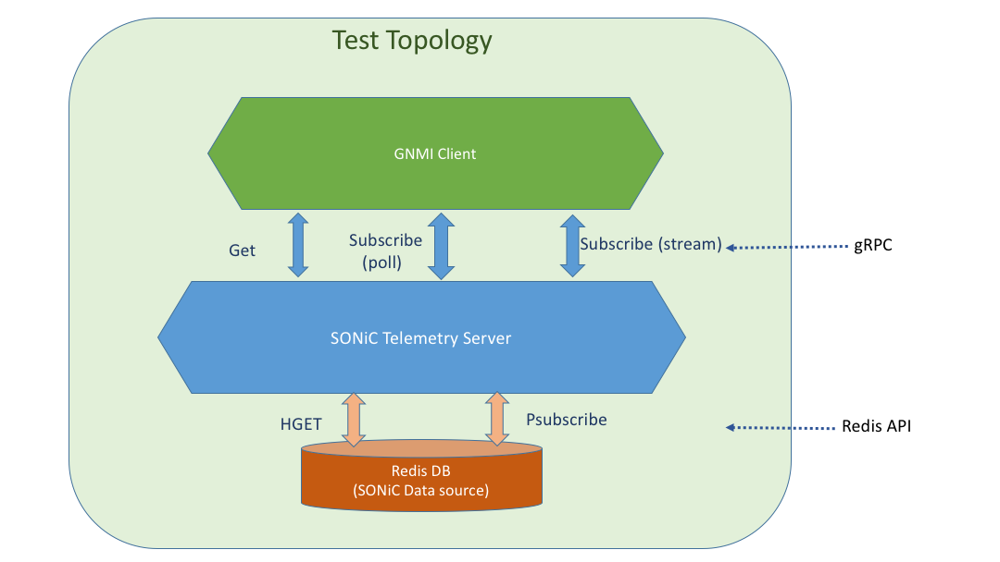
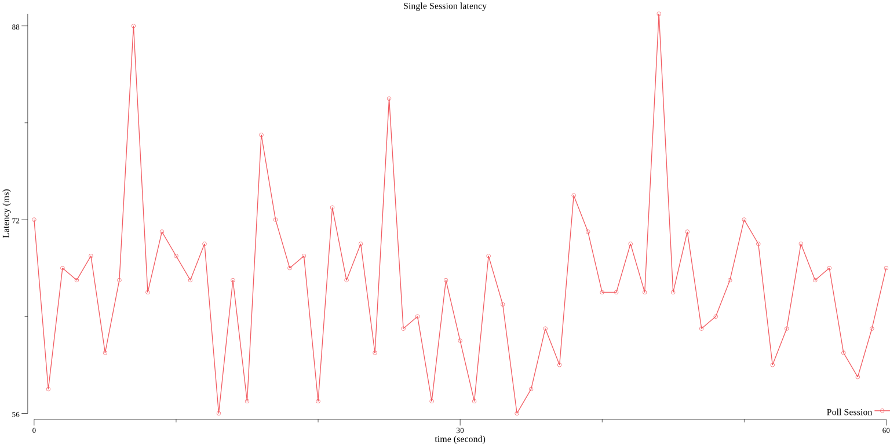
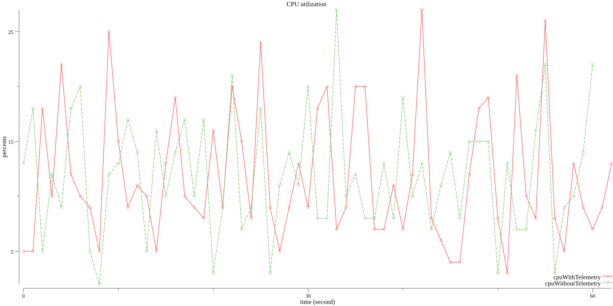
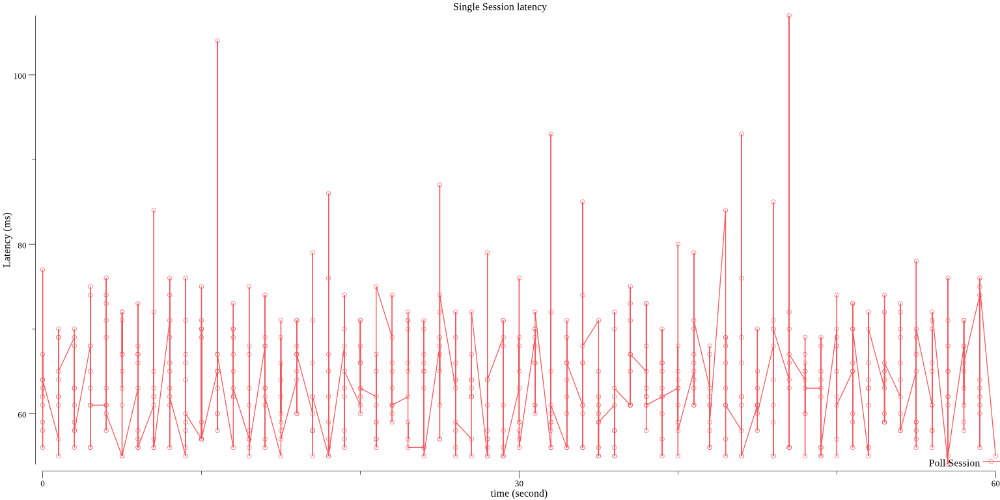
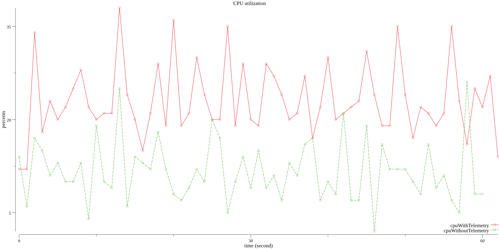

# SONiC gRPC data telemetry

   * [Overview of gRPC system data telemetry in SONiC](#overview-of-grpc-system-data-telemetry-in-sonic)
   * [Data available in SONiC](#data-available-in-sonic)
   * [SONiC system telemetry software architecture](#sonic-system-telemetry-software-architecture)
   * [gRPC operations for system telemetry in SONiC](#grpc-operations-for-system-telemetry-in-sonic)
      * [Usage of SONiC telemetry server binary](#usage-of-sonic-telemetry-server-binary)
      * [GetRequest/GetResponse](#getrequestgetresponse)
      * [SubscribeRequest/SubscribeResponse](#subscriberequestsubscriberesponse)
         * [Stream mode](#stream-mode)
         * [Poll mode](#poll-mode)
      * [Virtual path](#virtual-path)
   * [Authentication](#authentication)
   * [Encryption](#encryption)
   * [AutoTest](#autotest)
   * [Performance and Scale Test](#performance-and-scale-test)

# Overview of gRPC system data telemetry in SONiC

At the daily operation of datacenter network, being able to get the underlying characteristics of the network devices - either operational state or configuration, efficiently and quickly in structured format, will greatly facilitate the analysis of network status and improve network stability.  Besides the traditional data collecting methods like SNMP, syslog and CLI,  gRPC is the modern communication protocol supported by SONiC for telemetry streaming.

The implementation of gRPC system data telemetry is largely based on [gNMI](https://github.com/openconfig/reference/blob/master/rpc/gnmi/gnmi-specification.md) (gRPC Network Management Interface) with customization for SONiC.

# Data available in SONiC

In SONiC, most of the critical network and system data is stored in redisDB. Based on the data type and usage, they are spread in 7 DBs

|DB name    |   DB No. |     Description|
|  ----     |:----:| ----|
|APPL_DB    |  0 |   Application running data |
|ASIC_DB    |  1 |   ASIC configuration and state data
|COUNTERS_DB | 2 |   Counter data for port, lag, queue
|LOGLEVEL_DB | 3 |   Log level control for SONiC modules
|CONFIG_DB   | 4 |   Source of truth for SONiC configuration
|FLEX_COUNTER_DB| 5 | For PFC watch dog counters control and other plugin extensions
|STATE_DB       | 6 | Configuration state for object in CONFIG_DB

The role and layer of each DB is also shown in the diagram below:



Within each DB,  the data usually is organized in hierarchy of Table, key, field, value. Ex.  for "CONFIG_DB", there is "VLAN" table, and "Vlan1500" is one of the keys in this table,  associated with "Vlan1500" there is one field named "admin_status" with value of "up"

```
{
  "VLAN": {
    "Vlan1200": {
      "admin_status": "up",
      "description": "test 101",
      "members@": "Ethernet1,Ethernet9,Ethernet8,Ethernet2,Ethernet3",
      "mtu": "9100",
      "vlanid": "1200"
    },
    "Vlan1500": {
      "admin_status": "up",
      "description": "Test Vlan",
      "mtu": "9100"
    }
  }
}
```
Some data like COUNTERS table in COUNTERS_DB doesn't have key, but field and value are stored directly under COUNTERS table.

Refer to [SONiC data schema](https://github.com/sonic-net/sonic-swss-common/blob/master/common/schema.h) for more info about DB and table.

For data not available in DBs, Target name "OTHERS" is designated for that category of data, paths like platform/cpu or proc/loadavg under "OTHERS" target may be used get/subscribe the data.

# SONiC system telemetry software architecture
System telemetry in SONiC supports both dial-in mode and dial-out mode. The DB client takes care of retrieving data from SONiC redis database, while non-DB client serves data outside of redis databases. gRPC dial-in server (gNMI server) is described in this document,

# gRPC operations for system telemetry in SONiC
As mentioned at the beginning, SONiC gRPC data telemetry is largely based on gNMI protocol,  the GetRquest/GetResponse and SubscribeRequest/SubscribeResponse RPC have been implemented. Since SONiC doesn't have complete YANG data model yet, the DB, TABLE, KEY and Field path hierarchy is used as path to uniquely identify the configuration/state and counter data.

## Usage of SONiC telemetry server binary
The binary built from this repo is named as telemetry. To start gRPC data streaming service, simply run it on SONiC switch host environment (for now)
```
root@ASW:~# ./telemetry --help
Usage of ./telemetry:
  -allow_no_client_auth
      When set, telemetry server will request but not require a client certificate.
  -alsologtostderr
      log to standard error as well as files
  -ca_crt string
      CA certificate for client certificate validation. Optional.
  -insecure
      Skip providing TLS cert and key, for testing only!
  -log_backtrace_at value
      when logging hits line file:N, emit a stack trace
  -log_dir string
      If non-empty, write log files in this directory
  -logtostderr
      log to standard error instead of files
  -port int
      port to listen on (default -1)
  -server_crt string
      TLS server certificate
  -server_key string
      TLS server private key
  -stderrthreshold value
      logs at or above this threshold go to stderr
  -v value
      log level for V logs
  -vmodule value
      comma-separated list of pattern=N settings for file-filtered logging
```

```
root@ASW:~# ./telemetry --port 8080 --server_crt /etc/tls/publickey.cer --server_key /etc/tls/private.key --allow_no_client_auth --logtostderr
```
## GetRequest/GetResponse
The [gnmi_get](https://github.com/jipanyang/gnxi/tree/master/gnmi_get) tool may be used.

```
jipan@6068794801d2:/sonic/go/src/github.com/google/gnxi/gnmi_get$ ./gnmi_get --help
Usage of ./gnmi_get:
  -alsologtostderr
    	log to standard error as well as files
  -ca string
    	CA certificate file.
  -cert string
    	Certificate file.
  -encoding string
    	value encoding format to be used (default "JSON_IETF")
  -insecure
    	Skip TLS validation,
  -key string
    	Private key file.
  -log_backtrace_at value
    	when logging hits line file:N, emit a stack trace
  -log_dir string
    	If non-empty, write log files in this directory
  -logtostderr
    	log to standard error instead of files
  -password string
    	The password matching the provided username.
  -pbpath value
    	protobuf format path of the config node to be fetched
  -pretty
    	Shows PROTOs using Pretty package instead of PROTO Text Marshal
  -stderrthreshold value
    	logs at or above this threshold go to stderr
  -target_addr string
    	The target address in the format of host:port (default "localhost:10161")
  -target_name string
    	The target name use to verify the hostname returned by TLS handshake (default "hostname.com")
  -time_out duration
    	Timeout for the Get request, 10 seconds by default (default 10s)
  -username string
    	If specified, uses username/password credentials.
  -v value
    	log level for V logs
  -vmodule value
    	comma-separated list of pattern=N settings for file-filtered logging
  -xpath value
    	xpath of the config node to be fetched
  -xpath_target string
    	name of the target for which the path is a member (default "CONFIG_DB")
```

target in gNMI path prefix is set as "COUNTERS_DB", table name "COUNTERS_PORT_NAME_MAP" is set as value of path.
The example below shows how to get the interface name to object oid mapping. It can be used to find all Ethernet interfaces available on this system.

```
jipan@sonicvm1:~/work/go/src/github.com/jipanyang/gnxi/gnmi_get$ ./gnmi_get -xpath_target COUNTERS_DB -xpath COUNTERS_PORT_NAME_MAP -target_addr 30.57.185.38:8080 -alsologtostderr -insecure true
== getRequest:
prefix: <
  target: "COUNTERS_DB"
>
path: <
  elem: <
    name: "COUNTERS_PORT_NAME_MAP"
  >
>
encoding: JSON_IETF

== getResponse:
notification: <
  timestamp: 1516150813909959187
  prefix: <
    target: "COUNTERS_DB"
  >
  update: <
    path: <
      elem: <
        name: "COUNTERS_PORT_NAME_MAP"
      >
    >
    val: <
      json_ietf_val: "{\n  \"Ethernet0\": \"oid:0x1000000000002\",\n  \"Ethernet1\": \"oid:0x1000000000003\",\n  \"Ethernet10\": \"oid:0x100000000000c\",\n  \"Ethernet11\": \"oid:0x100000000000d\",\n  \"Ethernet12\": \"oid:0x100000000000e\",\n  \"Ethernet13\": \"oid:0x100000000000f\",\n  \"Ethernet14\": \"oid:0x1000000000010\",\n  \"Ethernet15\": \"oid:0x1000000000011\",\n  \"Ethernet16\": \"oid:0x1000000000012\",\n  \"Ethernet17\": \"oid:0x1000000000013\",\n  \"Ethernet18\": \"oid:0x1000000000014\",\n  \"Ethernet19\": \"oid:0x1000000000015\",\n  \"Ethernet2\": \"oid:0x1000000000004\",\n  \"Ethernet20\": \"oid:0x1000000000016\",\n  \"Ethernet21\": \"oid:0x1000000000017\",\n  \"Ethernet22\": \"oid:0x1000000000018\",\n  \"Ethernet23\": \"oid:0x1000000000019\",\n  \"Ethernet24\": \"oid:0x100000000001a\",\n  \"Ethernet25\": \"oid:0x100000000001b\",\n  \"Ethernet26\": \"oid:0x100000000001c\",\n  \"Ethernet27\": \"oid:0x100000000001d\",\n  \"Ethernet28\": \"oid:0x100000000001e\",\n  \"Ethernet29\": \"oid:0x100000000001f\",\n  \"Ethernet3\": \"oid:0x1000000000005\",\n  \"Ethernet30\": \"oid:0x1000000000020\",\n  \"Ethernet31\": \"oid:0x1000000000021\",\n  \"Ethernet32\": \"oid:0x1000000000022\",\n  \"Ethernet33\": \"oid:0x1000000000023\",\n  \"Ethernet34\": \"oid:0x1000000000024\",\n  \"Ethernet35\": \"oid:0x1000000000025\",\n  \"Ethernet36\": \"oid:0x1000000000027\",\n  \"Ethernet37\": \"oid:0x1000000000028\",\n  \"Ethernet38\": \"oid:0x1000000000029\",\n  \"Ethernet39\": \"oid:0x100000000002a\",\n  \"Ethernet4\": \"oid:0x1000000000006\",\n  \"Ethernet40\": \"oid:0x100000000002b\",\n  \"Ethernet41\": \"oid:0x100000000002c\",\n  \"Ethernet42\": \"oid:0x100000000002d\",\n  \"Ethernet43\": \"oid:0x100000000002e\",\n  \"Ethernet44\": \"oid:0x100000000002f\",\n  \"Ethernet45\": \"oid:0x1000000000030\",\n  \"Ethernet46\": \"oid:0x1000000000031\",\n  \"Ethernet47\": \"oid:0x1000000000032\",\n  \"Ethernet48\": \"oid:0x1000000000033\",\n  \"Ethernet5\": \"oid:0x1000000000007\",\n  \"Ethernet52\": \"oid:0x1000000000035\",\n  \"Ethernet56\": \"oid:0x1000000000036\",\n  \"Ethernet6\": \"oid:0x1000000000008\",\n  \"Ethernet60\": \"oid:0x1000000000037\",\n  \"Ethernet64\": \"oid:0x1000000000038\",\n  \"Ethernet68\": \"oid:0x1000000000039\",\n  \"Ethernet7\": \"oid:0x1000000000009\",\n  \"Ethernet8\": \"oid:0x100000000000a\",\n  \"Ethernet9\": \"oid:0x100000000000b\"\n}"
    >
  >
>
```

Let's fetch all counters under Ethernet9:

```
jipan@sonicvm1:~/work/go/src/github.com/jipanyang/gnxi/gnmi_get$ ./gnmi_get -xpath_target COUNTERS_DB -xpath COUNTERS/Ethernet9 -target_addr 30.57.185.38:8080 -alsologtostderr -insecure true
== getRequest:
prefix: <
  target: "COUNTERS_DB"
>
path: <
  elem: <
    name: "COUNTERS"
  >
  elem: <
    name: "Ethernet9"
  >
>
encoding: JSON_IETF

== getResponse:
notification: <
  timestamp: 1516668828794942666
  prefix: <
    target: "COUNTERS_DB"
  >
  update: <
    path: <
      elem: <
        name: "COUNTERS"
      >
      elem: <
        name: "Ethernet9"
      >
    >
    val: <
      json_ietf_val: "{\n  \"SAI_PORT_STAT_ETHER_IN_PKTS_1024_TO_1518_OCTETS\": \"0\",\n  \"SAI_PORT_STAT_ETHER_IN_PKTS_128_TO_255_OCTETS\": \"0\",\n  \"SAI_PORT_STAT_ETHER_IN_PKTS_1519_TO_2047_OCTETS\": \"0\",\n  \"SAI_PORT_STAT_ETHER_IN_PKTS_2048_TO_4095_OCTETS\": \"0\",\n  \"SAI_PORT_STAT_ETHER_IN_PKTS_256_TO_511_OCTETS\": \"0\",\n  \"SAI_PORT_STAT_ETHER_IN_PKTS_4096_TO_9216_OCTETS\": \"0\",\n  \"SAI_PORT_STAT_ETHER_IN_PKTS_512_TO_1023_OCTETS\": \"0\",\n  \"SAI_PORT_STAT_ETHER_IN_PKTS_64_OCTETS\": \"0\",\n  \"SAI_PORT_STAT_ETHER_IN_PKTS_65_TO_127_OCTETS\": \"0\",\n  \"SAI_PORT_STAT_ETHER_IN_PKTS_9217_TO_16383_OCTETS\": \"0\",\n  \"SAI_PORT_STAT_ETHER_OUT_PKTS_1024_TO_1518_OCTETS\": \"0\",\n  \"SAI_PORT_STAT_ETHER_OUT_PKTS_128_TO_255_OCTETS\": \"0\",\n  \"SAI_PORT_STAT_ETHER_OUT_PKTS_1519_TO_2047_OCTETS\": \"0\",\n  \"SAI_PORT_STAT_ETHER_OUT_PKTS_2048_TO_4095_OCTETS\": \"0\",\n  \"SAI_PORT_STAT_ETHER_OUT_PKTS_256_TO_511_OCTETS\": \"0\",\n  \"SAI_PORT_STAT_ETHER_OUT_PKTS_4096_TO_9216_OCTETS\": \"0\",\n  \"SAI_PORT_STAT_ETHER_OUT_PKTS_512_TO_1023_OCTETS\": \"0\",\n  \"SAI_PORT_STAT_ETHER_OUT_PKTS_64_OCTETS\": \"0\",\n  \"SAI_PORT_STAT_ETHER_OUT_PKTS_65_TO_127_OCTETS\": \"0\",\n  \"SAI_PORT_STAT_ETHER_OUT_PKTS_9217_TO_16383_OCTETS\": \"0\",\n  \"SAI_PORT_STAT_ETHER_RX_OVERSIZE_PKTS\": \"0\",\n  \"SAI_PORT_STAT_ETHER_STATS_BROADCAST_PKTS\": \"0\",\n  \"SAI_PORT_STAT_ETHER_STATS_COLLISIONS\": \"0\",\n  \"SAI_PORT_STAT_ETHER_STATS_CRC_ALIGN_ERRORS\": \"0\",\n  \"SAI_PORT_STAT_ETHER_STATS_DROP_EVENTS\": \"0\",\n  \"SAI_PORT_STAT_ETHER_STATS_FRAGMENTS\": \"0\",\n  \"SAI_PORT_STAT_ETHER_STATS_JABBERS\": \"0\",\n  \"SAI_PORT_STAT_ETHER_STATS_MULTICAST_PKTS\": \"0\",\n  \"SAI_PORT_STAT_ETHER_STATS_OCTETS\": \"0\",\n  \"SAI_PORT_STAT_ETHER_STATS_OVERSIZE_PKTS\": \"0\",\n  \"SAI_PORT_STAT_ETHER_STATS_PKTS\": \"0\",\n  \"SAI_PORT_STAT_ETHER_STATS_PKTS_1024_TO_1518_OCTETS\": \"0\",\n  \"SAI_PORT_STAT_ETHER_STATS_PKTS_128_TO_255_OCTETS\": \"0\",\n  \"SAI_PORT_STAT_ETHER_STATS_PKTS_1519_TO_2047_OCTETS\": \"0\",\n  \"SAI_PORT_STAT_ETHER_STATS_PKTS_2048_TO_4095_OCTETS\": \"0\",\n  \"SAI_PORT_STAT_ETHER_STATS_PKTS_256_TO_511_OCTETS\": \"0\",\n  \"SAI_PORT_STAT_ETHER_STATS_PKTS_4096_TO_9216_OCTETS\": \"0\",\n  \"SAI_PORT_STAT_ETHER_STATS_PKTS_512_TO_1023_OCTETS\": \"0\",\n  \"SAI_PORT_STAT_ETHER_STATS_PKTS_64_OCTETS\": \"0\",\n  \"SAI_PORT_STAT_ETHER_STATS_PKTS_65_TO_127_OCTETS\": \"0\",\n  \"SAI_PORT_STAT_ETHER_STATS_PKTS_9217_TO_16383_OCTETS\": \"0\",\n  \"SAI_PORT_STAT_ETHER_STATS_RX_NO_ERRORS\": \"0\",\n  \"SAI_PORT_STAT_ETHER_STATS_TX_NO_ERRORS\": \"0\",\n  \"SAI_PORT_STAT_ETHER_STATS_UNDERSIZE_PKTS\": \"0\",\n  \"SAI_PORT_STAT_ETHER_TX_OVERSIZE_PKTS\": \"0\",\n  \"SAI_PORT_STAT_IF_IN_BROADCAST_PKTS\": \"0\",\n  \"SAI_PORT_STAT_IF_IN_DISCARDS\": \"0\",\n  \"SAI_PORT_STAT_IF_IN_ERRORS\": \"0\",\n  \"SAI_PORT_STAT_IF_IN_MULTICAST_PKTS\": \"0\",\n  \"SAI_PORT_STAT_IF_IN_NON_UCAST_PKTS\": \"0\",\n  \"SAI_PORT_STAT_IF_IN_OCTETS\": \"0\",\n  \"SAI_PORT_STAT_IF_IN_UCAST_PKTS\": \"0\",\n  \"SAI_PORT_STAT_IF_IN_UNKNOWN_PROTOS\": \"0\",\n  \"SAI_PORT_STAT_IF_IN_VLAN_DISCARDS\": \"0\",\n  \"SAI_PORT_STAT_IF_OUT_BROADCAST_PKTS\": \"0\",\n  \"SAI_PORT_STAT_IF_OUT_DISCARDS\": \"0\",\n  \"SAI_PORT_STAT_IF_OUT_ERRORS\": \"0\",\n  \"SAI_PORT_STAT_IF_OUT_MULTICAST_PKTS\": \"0\",\n  \"SAI_PORT_STAT_IF_OUT_NON_UCAST_PKTS\": \"0\",\n  \"SAI_PORT_STAT_IF_OUT_OCTETS\": \"0\",\n  \"SAI_PORT_STAT_IF_OUT_QLEN\": \"0\",\n  \"SAI_PORT_STAT_IF_OUT_UCAST_PKTS\": \"0\",\n  \"SAI_PORT_STAT_IPV6_IN_DISCARDS\": \"0\",\n  \"SAI_PORT_STAT_IPV6_IN_MCAST_PKTS\": \"0\",\n  \"SAI_PORT_STAT_IPV6_IN_NON_UCAST_PKTS\": \"0\",\n  \"SAI_PORT_STAT_IPV6_IN_OCTETS\": \"0\",\n  \"SAI_PORT_STAT_IPV6_IN_RECEIVES\": \"0\",\n  \"SAI_PORT_STAT_IPV6_IN_UCAST_PKTS\": \"0\",\n  \"SAI_PORT_STAT_IPV6_OUT_DISCARDS\": \"0\",\n  \"SAI_PORT_STAT_IPV6_OUT_MCAST_PKTS\": \"0\",\n  \"SAI_PORT_STAT_IPV6_OUT_NON_UCAST_PKTS\": \"0\",\n  \"SAI_PORT_STAT_IPV6_OUT_OCTETS\": \"0\",\n  \"SAI_PORT_STAT_IPV6_OUT_UCAST_PKTS\": \"0\",\n  \"SAI_PORT_STAT_IP_IN_DISCARDS\": \"0\",\n  \"SAI_PORT_STAT_IP_IN_NON_UCAST_PKTS\": \"0\",\n  \"SAI_PORT_STAT_IP_IN_OCTETS\": \"0\",\n  \"SAI_PORT_STAT_IP_IN_RECEIVES\": \"0\",\n  \"SAI_PORT_STAT_IP_IN_UCAST_PKTS\": \"0\",\n  \"SAI_PORT_STAT_IP_OUT_DISCARDS\": \"0\",\n  \"SAI_PORT_STAT_IP_OUT_NON_UCAST_PKTS\": \"0\",\n  \"SAI_PORT_STAT_IP_OUT_OCTETS\": \"0\",\n  \"SAI_PORT_STAT_IP_OUT_UCAST_PKTS\": \"0\",\n  \"SAI_PORT_STAT_PFC_0_ON2OFF_RX_PKTS\": \"0\",\n  \"SAI_PORT_STAT_PFC_0_RX_PKTS\": \"0\",\n  \"SAI_PORT_STAT_PFC_0_TX_PKTS\": \"0\",\n  \"SAI_PORT_STAT_PFC_1_ON2OFF_RX_PKTS\": \"0\",\n  \"SAI_PORT_STAT_PFC_1_RX_PKTS\": \"0\",\n  \"SAI_PORT_STAT_PFC_1_TX_PKTS\": \"0\",\n  \"SAI_PORT_STAT_PFC_2_ON2OFF_RX_PKTS\": \"0\",\n  \"SAI_PORT_STAT_PFC_2_RX_PKTS\": \"0\",\n  \"SAI_PORT_STAT_PFC_2_TX_PKTS\": \"0\",\n  \"SAI_PORT_STAT_PFC_3_ON2OFF_RX_PKTS\": \"0\",\n  \"SAI_PORT_STAT_PFC_3_RX_PKTS\": \"0\",\n  \"SAI_PORT_STAT_PFC_3_TX_PKTS\": \"0\",\n  \"SAI_PORT_STAT_PFC_4_ON2OFF_RX_PKTS\": \"0\",\n  \"SAI_PORT_STAT_PFC_4_RX_PKTS\": \"0\",\n  \"SAI_PORT_STAT_PFC_4_TX_PKTS\": \"0\",\n  \"SAI_PORT_STAT_PFC_5_ON2OFF_RX_PKTS\": \"0\",\n  \"SAI_PORT_STAT_PFC_5_RX_PKTS\": \"0\",\n  \"SAI_PORT_STAT_PFC_5_TX_PKTS\": \"0\",\n  \"SAI_PORT_STAT_PFC_6_ON2OFF_RX_PKTS\": \"0\",\n  \"SAI_PORT_STAT_PFC_6_RX_PKTS\": \"0\",\n  \"SAI_PORT_STAT_PFC_6_TX_PKTS\": \"0\",\n  \"SAI_PORT_STAT_PFC_7_ON2OFF_RX_PKTS\": \"0\",\n  \"SAI_PORT_STAT_PFC_7_RX_PKTS\": \"0\",\n  \"SAI_PORT_STAT_PFC_7_TX_PKTS\": \"0\"\n}"
    >
  >
>

```

Or just one specific counter "SAI_PORT_STAT_PFC_7_RX_PKTS":

```
jipan@sonicvm1:~/work/go/src/github.com/jipanyang/gnxi/gnmi_get$ ./gnmi_get -xpath_target COUNTERS_DB -xpath COUNTERS/Ethernet9/SAI_PORT_STAT_PFC_7_RX_PKTS -target_addr 30.57.185.38:8080 -alsologtostderr -insecure true
== getRequest:
prefix: <
  target: "COUNTERS_DB"
>
path: <
  elem: <
    name: "COUNTERS"
  >
  elem: <
    name: "Ethernet9"
  >
  elem: <
    name: "SAI_PORT_STAT_PFC_7_RX_PKTS"
  >
>
encoding: JSON_IETF

== getResponse:
notification: <
  timestamp: 1516669320434130423
  prefix: <
    target: "COUNTERS_DB"
  >
  update: <
    path: <
      elem: <
        name: "COUNTERS"
      >
      elem: <
        name: "Ethernet9"
      >
      elem: <
        name: "SAI_PORT_STAT_PFC_7_RX_PKTS"
      >
    >
    val: <
      string_val: "0"
    >
  >
>
```

It is also possible to specifify multiple xpath values. Here we get values for both SAI_PORT_STAT_PFC_7_RX_PKTS and SAI_PORT_STAT_PFC_1_RX_PKTS:
```
jipan@sonicvm1:~/work/go/src/github.com/jipanyang/gnxi/gnmi_get$ ./gnmi_get -xpath_target COUNTERS_DB -xpath "COUNTERS/Ethernet9/SAI_PORT_STAT_PFC_7_RX_PKTS" -xpath "COUNTERS/Ethernet9/SAI_PORT_STAT_PFC_1_RX_PKTS" -target_addr 30.57.185.38:8080 -alsologtostderr -insecure true
```

## SubscribeRequest/SubscribeResponse
### Stream mode

[The GNMI specification](https://github.com/openconfig/reference/blob/master/rpc/gnmi/gnmi-specification.md#35152-stream-subscriptions) defines 3 different streaming `modes` for each `Subscription` that found in `SubscriptionList`:

- On Change (ON_CHANGE)
- Sampled (SAMPLE)
- Target Defined (TARGET_DEFINED) The Sonic Telemetry service **does NOT** support `TARGET_DEFINED` mode at this time.

#### On Change (**ON_CHANGE**) Subscription:
When a subscription is defined to be "on change", data updates are only sent when the value of the data item changes. With `ON_CHANGE` stream mode of `Subscription`, 
- SONiC will first send all data on the requested path to data collector,
- Will send the `sync_response` message to indicate the end of all data.
- Then stream data to collector upon any change on the path.

[gnmi_cli_py](https://github.com/lguohan/gnxi/tree/master/gnmi_cli_py) could be used to exercise gRPC SubscribeRequest. Here is an example usage anytime the PFC counter on queue 7 of Ethernet0 "COUNTERS/Ethernet0/SAI_PORT_STAT_PFC_7_RX_PKTS" has change, the update is streamed to gnmi_cli_py collector.

In the CLI command, the `"--submode 1"` means `ON_CHANGE` mode for the `Subscription`.

Notice the 4 sections in the output:

- The payload that being sent to telemetry service. It has the path information plus the `ON_CHANGE` mode for the `Subscription`. The `sample_interval` is ignored for this kind of streaming (`ON_CHANGE`).
- The first response where the server sends all data for the requested path.
- The `sync_response` message which indicates that the initial sync is complete.
- Another response upon a change. It is sent after the path data changed from `"0"` to `"1"`.

```bash
./gnmi_cli_py/py_gnmicli.py -g -t 192.168.43.183 -p 8080 -m subscribe --submode 1 -x "COUNTERS/Ethernet0/SAI_PORT_STAT_PFC_7_RX_PKTS"  -xt COUNTERS_DB -o "ndastreamingservertest"

Sending SubscribeRequest
subscribe {
  prefix {
    target: "COUNTERS_DB"
  }
  subscription {
    path {
      elem {
        name: "COUNTERS"
      }
      elem {
        name: "Ethernet0"
      }
      elem {
        name: "SAI_PORT_STAT_PFC_7_RX_PKTS"
      }
    }
    mode: ON_CHANGE
    sample_interval: 10000000000
  }
}

2020-12-01 15:08:32.616647 response received: 
update {
  timestamp: 1606864112615683213
  prefix {
    target: "COUNTERS_DB"
  }
  update {
    path {
      elem {
        name: "COUNTERS"
      }
      elem {
        name: "Ethernet0"
      }
      elem {
        name: "SAI_PORT_STAT_PFC_7_RX_PKTS"
      }
    }
    val {
      string_val: "0"
    }
  }
}

2020-12-01 15:08:32.617109 response received: 
sync_response: true

2020-12-01 15:09:34.184855 response received: 
update {
  timestamp: 1606864174183672637
  prefix {
    target: "COUNTERS_DB"
  }
  update {
    path {
      elem {
        name: "COUNTERS"
      }
      elem {
        name: "Ethernet0"
      }
      elem {
        name: "SAI_PORT_STAT_PFC_7_RX_PKTS"
      }
    }
    val {
      string_val: "1"
    }
  }
}
```

#### Sampled (**SAMPLE**) Subscription:

A subscription that is defined to be sampled. It MUST be specified along with a `sample_interval`.

For a `Subscription` with `SAMPLE` mode; 
- SONiC will first send all data on the requested path to data collector (Same as `ON_CHANGE`).
- Will send the `sync_response` message to indicate the end of all data (Same as `ON_CHANGE`).
- Then the value of the data item(s) are sent once per `sample_interval` to the client. `sample_interval` is an unsigned 64-bit integer representing nanoseconds between samples. Currently this interval cannot be less than 1 second else it is considered as an invalid argument. However, `0` is a special case where it is not error but translates to the minimum interval (`1s`).

Below is an example query and response for `SAMPLE` streaming using [gnmi_cli_py](https://github.com/lguohan/gnxi/tree/master/gnmi_cli_py). The important arguments in the CLI command are:

- The `"--submode 2"` argument is to tell that the `Subscription` is `SAMPLE` mode.
- The `"--interval 2000"` argument is to set `sample_interval` to 2000ms (2s).
- The `"--update_count 3"` argument tells the client tool to stop after receiving 3 updates. This is only for testing purposes. In real life the streaming is meant to be continuos.

Notice the 4 sections in the command output:

- The payload that being sent to telemetry service. It has the path information plus the **SAMPLE** mode for the Subscription.
- The first response where the server sends all data for the requested path.
- The sync_response message which indicates that the initial sync is complete.
- Another 2 responses after the sample interval elapsed 2 times.


```bash
./gnmi_cli_py/py_gnmicli.py -g -t 192.168.43.183 -p 8080 -m subscribe --submode 2 -x "COUNTERS/Ethernet0/SAI_PORT_STAT_PFC_7_RX_PKTS"  -xt COUNTERS_DB -o "ndastreamingservertest" --interval 2000 --update_count 3

Sending SubscribeRequest
subscribe {
  prefix {
    target: "COUNTERS_DB"
  }
  subscription {
    path {
      elem {
        name: "COUNTERS"
      }
      elem {
        name: "Ethernet0"
      }
      elem {
        name: "SAI_PORT_STAT_PFC_7_RX_PKTS"
      }
    }
    mode: SAMPLE
    sample_interval: 2000000000
  }
}

2020-12-01 16:41:09.432473 response received: 
update {
  timestamp: 1606869669431526704
  prefix {
    target: "COUNTERS_DB"
  }
  update {
    path {
      elem {
        name: "COUNTERS"
      }
      elem {
        name: "Ethernet0"
      }
      elem {
        name: "SAI_PORT_STAT_PFC_7_RX_PKTS"
      }
    }
    val {
      string_val: "1"
    }
  }
}

2020-12-01 16:41:09.432956 response received: 
sync_response: true

2020-12-01 16:41:11.432688 response received: 
update {
  timestamp: 1606869671432005971
  prefix {
    target: "COUNTERS_DB"
  }
  update {
    path {
      elem {
        name: "COUNTERS"
      }
      elem {
        name: "Ethernet0"
      }
      elem {
        name: "SAI_PORT_STAT_PFC_7_RX_PKTS"
      }
    }
    val {
      string_val: "1"
    }
  }
}

2020-12-01 16:41:13.433170 response received: 
update {
  timestamp: 1606869673432508038
  prefix {
    target: "COUNTERS_DB"
  }
  update {
    path {
      elem {
        name: "COUNTERS"
      }
      elem {
        name: "Ethernet0"
      }
      elem {
        name: "SAI_PORT_STAT_PFC_7_RX_PKTS"
      }
    }
    val {
      string_val: "1"
    }
  }
}

Max update count reached 3
```

### Poll mode
With poll mode SubscribeRequest, collector poll the data path periodically. Example below shows the command line used and the corresponding output: ( -qt p -pi 10s) query type is polling and polling interval of 10s.

```
jipan@sonicvm1:~/work/go/src/github.com/jipanyang/gnmi/cmd/gnmi_cli$ ./gnmi_cli --client_types=gnmi -a 30.57.185.38:8080 -q "COUNTERS/Ethernet9/SAI_PORT_STAT_PFC_7_RX_PKTS" -logtostderr -insecure -timestamp on -t COUNTERS_DB -v 0 -qt p -pi 10s
sendQueryAndDisplay: GROUP poll [[COUNTERS Ethernet9 SAI_PORT_STAT_PFC_7_RX_PKTS]]
{
  "COUNTERS": {
    "Ethernet9": {
      "SAI_PORT_STAT_PFC_7_RX_PKTS": {
        "timestamp": "2018-03-01-18:40:45.775251073",
        "value": "0"
      }
    }
  }
}
{
  "COUNTERS": {
    "Ethernet9": {
      "SAI_PORT_STAT_PFC_7_RX_PKTS": {
        "timestamp": "2018-03-01-18:40:55.776494910",
        "value": "0"
      }
    }
  }
}
```

The data not available in DB also support poll subscription and get.  So far under "OTHERS" target, platform/cpu, proc/stat, proc/meminfo, proc/loadavg, proc/vmstat, and proc/diskstats are the paths supported.
```
jipan@sonicvm1:~/work/go/src/github.com/jipanyang/gnmi/cmd/gnmi_cli$ ./gnmi_cli -client_types=gnmi -a 30.57.185.38:8080 -t OTHERS -logtostderr -insecure -qt p -pi 10s -q proc/loadavg
sendQueryAndDisplay: GROUP poll [[proc loadavg]]
{
  "proc": {
    "loadavg": {
      "last15min": 0.89,
      "last1min": 1.13,
      "last5min": 0.85,
      "last_pid": 868,
      "process_running": 2,
      "process_total": 530
    }
  }
}
{
  "proc": {
    "loadavg": {
      "last15min": 0.91,
      "last1min": 1.34,
      "last5min": 0.91,
      "last_pid": 868,
      "process_running": 2,
      "process_total": 530
    }
  }
}
```


## Virtual path
Some of the SONiC database tables contain aggregated data. Ex. COUNTERS in COUNTER_DB stores stats of Ports, Queues and others type of SONiC objects, also the key in table is oid which is only meaningful inside SONiC. The virtual path concept is introduced for SONiC telemetry. It doesn't exist in SONiC redis database, telemetry module performs internal translation to map it to real data path and returns data accordingly. Virtual paths supported so far:

|  DB target|   Virtual Path  |     Description|
|  ----     |:----:| ----|
|COUNTERS_DB | "COUNTERS/Ethernet*"|  All counters on all Ethernet ports
|COUNTERS_DB | "COUNTERS/Ethernet*/``<counter name``>"|  One counter on all Ethernet ports
|COUNTERS_DB | "COUNTERS/Ethernet``<port number``>/``<counter name``>"|  One counter on one Ethernet port
|COUNTERS_DB | "COUNTERS/Ethernet*/Queues"|  Queues stats on all Ethernet ports
|COUNTERS_DB | "COUNTERS/Ethernet``<port number``>/Queues"|  Queue stats on one Ethernet ports

Virtual path supports Get, Subscribe Poll and stream operations.

```
jipan@sonicvm1:~/work/go/src/github.com/jipanyang/gnxi/gnmi_get$ go run gnmi_get.go -xpath_target COUNTERS_DB -xpath "COUNTERS/Ethernet*" -target_addr 30.57.185.38:8080 -alsologtostderr -insecure true
== getRequest:
prefix: <
  target: "COUNTERS_DB"
>
path: <
  elem: <
    name: "COUNTERS"
  >
  elem: <
    name: "Ethernet*"
  >
>
encoding: JSON_IETF

== getResponse:
notification: <
  timestamp: 1518331479776983023
  prefix: <
    target: "COUNTERS_DB"
  >
  update: <
    path: <
      elem: <
        name: "COUNTERS"
      >
      elem: <
        name: "Ethernet*"
      >
    >
    val: <
      json_ietf_val: "{\"Ethernet0\":{\"SAI_PORT_STAT_ETHER_IN_PKTS_1024_TO_1518_OCTETS\":\"0\",\"SAI_PORT_STAT_ETHER_IN_PKTS_128_TO_255_OCTETS\":\"0\",\"SAI_PORT_STAT_ETHER_IN_PKTS_1519_TO_2047_OCTETS\":\"0\",\"SAI_PORT_STAT_ETHER_IN_PKTS_2048_TO_4095_OCTETS\":\"0\", .........},
      \"Ethernet9\":{\"SAI_PORT_STAT_ETHER_IN_PKTS_1024_TO_1518_OCTETS\":\"0\",....\"SAI_PORT_STAT_PFC_7_TX_PKTS\":\"0\"}}"
    >
  >
>
```

```
jipan@6068794801d2:/sonic/go/src/github.com/google/gnxi/gnmi_get$ go run gnmi_get.go -xpath_target COUNTERS_DB -xpath "COUNTERS/Ethernet*/SAI_PORT_STAT_PFC_7_ON2OFF_RX_PKTS" -target_addr 30.57.185.38:8080 -alsologtostderr -insecure true
== getRequest:
prefix: <
  target: "COUNTERS_DB"
>
path: <
  elem: <
    name: "COUNTERS"
  >
  elem: <
    name: "Ethernet*"
  >
  elem: <
    name: "SAI_PORT_STAT_PFC_7_ON2OFF_RX_PKTS"
  >
>
encoding: JSON_IETF

== getResponse:
notification: <
  timestamp: 1518331688431153677
  prefix: <
    target: "COUNTERS_DB"
  >
  update: <
    path: <
      elem: <
        name: "COUNTERS"
      >
      elem: <
        name: "Ethernet*"
      >
      elem: <
        name: "SAI_PORT_STAT_PFC_7_ON2OFF_RX_PKTS"
      >
    >
    val: <
      json_ietf_val: "{\"Ethernet0\":{\"SAI_PORT_STAT_PFC_7_ON2OFF_RX_PKTS\":\"0\"},\"Ethernet1\":{\"SAI_PORT_STAT_PFC_7_ON2OFF_RX_PKTS\":\"0\"},\"Ethernet10\":{\"SAI_PORT_STAT_PFC_7_ON2OFF_RX_PKTS\":\"0\"},\"Ethernet11\":{\"SAI_PORT_STAT_PFC_7_ON2OFF_RX_PKTS\":\"0\"},\"Ethernet12\":{\"SAI_PORT_STAT_PFC_7_ON2OFF_RX_PKTS\":\"0\"},\"Ethernet13\":{\"SAI_PORT_STAT_PFC_7_ON2OFF_RX_PKTS\":\"0\"},\"Ethernet14\":{\"SAI_PORT_STAT_PFC_7_ON2OFF_RX_PKTS\":\"0\"},\"Ethernet15\":{\"SAI_PORT_STAT_PFC_7_ON2OFF_RX_PKTS\":\"0\"},\"Ethernet16\":{\"SAI_PORT_STAT_PFC_7_ON2OFF_RX_PKTS\":\"0\"},\"Ethernet17\":{\"SAI_PORT_STAT_PFC_7_ON2OFF_RX_PKTS\":\"0\"},\"Ethernet18\":{\"SAI_PORT_STAT_PFC_7_ON2OFF_RX_PKTS\":\"0\"},\"Ethernet19\":{\"SAI_PORT_STAT_PFC_7_ON2OFF_RX_PKTS\":\"0\"},\"Ethernet2\":{\"SAI_PORT_STAT_PFC_7_ON2OFF_RX_PKTS\":\"0\"},\"Ethernet20\":{\"SAI_PORT_STAT_PFC_7_ON2OFF_RX_PKTS\":\"0\"},\"Ethernet21\":{\"SAI_PORT_STAT_PFC_7_ON2OFF_RX_PKTS\":\"0\"},\"Ethernet22\":{\"SAI_PORT_STAT_PFC_7_ON2OFF_RX_PKTS\":\"0\"},\"Ethernet23\":{\"SAI_PORT_STAT_PFC_7_ON2OFF_RX_PKTS\":\"0\"},\"Ethernet24\":{\"SAI_PORT_STAT_PFC_7_ON2OFF_RX_PKTS\":\"0\"},\"Ethernet25\":{\"SAI_PORT_STAT_PFC_7_ON2OFF_RX_PKTS\":\"0\"},\"Ethernet26\":{\"SAI_PORT_STAT_PFC_7_ON2OFF_RX_PKTS\":\"0\"},\"Ethernet27\":{\"SAI_PORT_STAT_PFC_7_ON2OFF_RX_PKTS\":\"0\"},\"Ethernet28\":{\"SAI_PORT_STAT_PFC_7_ON2OFF_RX_PKTS\":\"0\"},\"Ethernet29\":{\"SAI_PORT_STAT_PFC_7_ON2OFF_RX_PKTS\":\"0\"},\"Ethernet3\":{\"SAI_PORT_STAT_PFC_7_ON2OFF_RX_PKTS\":\"0\"},\"Ethernet30\":{\"SAI_PORT_STAT_PFC_7_ON2OFF_RX_PKTS\":\"0\"},\"Ethernet31\":{\"SAI_PORT_STAT_PFC_7_ON2OFF_RX_PKTS\":\"0\"},\"Ethernet32\":{\"SAI_PORT_STAT_PFC_7_ON2OFF_RX_PKTS\":\"0\"},\"Ethernet33\":{\"SAI_PORT_STAT_PFC_7_ON2OFF_RX_PKTS\":\"0\"},\"Ethernet34\":{\"SAI_PORT_STAT_PFC_7_ON2OFF_RX_PKTS\":\"0\"},\"Ethernet35\":{\"SAI_PORT_STAT_PFC_7_ON2OFF_RX_PKTS\":\"0\"},\"Ethernet36\":{\"SAI_PORT_STAT_PFC_7_ON2OFF_RX_PKTS\":\"0\"},\"Ethernet37\":{\"SAI_PORT_STAT_PFC_7_ON2OFF_RX_PKTS\":\"0\"},\"Ethernet38\":{\"SAI_PORT_STAT_PFC_7_ON2OFF_RX_PKTS\":\"0\"},\"Ethernet39\":{\"SAI_PORT_STAT_PFC_7_ON2OFF_RX_PKTS\":\"0\"},\"Ethernet4\":{\"SAI_PORT_STAT_PFC_7_ON2OFF_RX_PKTS\":\"0\"},\"Ethernet40\":{\"SAI_PORT_STAT_PFC_7_ON2OFF_RX_PKTS\":\"0\"},\"Ethernet41\":{\"SAI_PORT_STAT_PFC_7_ON2OFF_RX_PKTS\":\"0\"},\"Ethernet42\":{\"SAI_PORT_STAT_PFC_7_ON2OFF_RX_PKTS\":\"0\"},\"Ethernet43\":{\"SAI_PORT_STAT_PFC_7_ON2OFF_RX_PKTS\":\"0\"},\"Ethernet44\":{\"SAI_PORT_STAT_PFC_7_ON2OFF_RX_PKTS\":\"0\"},\"Ethernet45\":{\"SAI_PORT_STAT_PFC_7_ON2OFF_RX_PKTS\":\"0\"},\"Ethernet46\":{\"SAI_PORT_STAT_PFC_7_ON2OFF_RX_PKTS\":\"0\"},\"Ethernet47\":{\"SAI_PORT_STAT_PFC_7_ON2OFF_RX_PKTS\":\"0\"},\"Ethernet48\":{\"SAI_PORT_STAT_PFC_7_ON2OFF_RX_PKTS\":\"0\"},\"Ethernet5\":{\"SAI_PORT_STAT_PFC_7_ON2OFF_RX_PKTS\":\"0\"},\"Ethernet52\":{\"SAI_PORT_STAT_PFC_7_ON2OFF_RX_PKTS\":\"0\"},\"Ethernet56\":{\"SAI_PORT_STAT_PFC_7_ON2OFF_RX_PKTS\":\"0\"},\"Ethernet6\":{\"SAI_PORT_STAT_PFC_7_ON2OFF_RX_PKTS\":\"0\"},\"Ethernet60\":{\"SAI_PORT_STAT_PFC_7_ON2OFF_RX_PKTS\":\"0\"},\"Ethernet64\":{\"SAI_PORT_STAT_PFC_7_ON2OFF_RX_PKTS\":\"0\"},\"Ethernet68\":{\"SAI_PORT_STAT_PFC_7_ON2OFF_RX_PKTS\":\"0\"},\"Ethernet7\":{\"SAI_PORT_STAT_PFC_7_ON2OFF_RX_PKTS\":\"0\"},\"Ethernet8\":{\"SAI_PORT_STAT_PFC_7_ON2OFF_RX_PKTS\":\"0\"},\"Ethernet9\":{\"SAI_PORT_STAT_PFC_7_ON2OFF_RX_PKTS\":\"0\"}}"
    >
  >
>
```

```
jipan@sonicvm1:~/work/go/src/github.com/jipanyang/gnxi/gnmi_get$ go run gnmi_get.go -xpath_target COUNTERS_DB -xpath COUNTERS/Ethernet68/Queues -target_addr 30.57.185.38:8080 -alsologtostderr -insecure true
== getRequest:
prefix: <
  target: "COUNTERS_DB"
>
path: <
  elem: <
    name: "COUNTERS"
  >
  elem: <
    name: "Ethernet68"
  >
  elem: <
    name: "Queues"
  >
>
encoding: JSON_IETF

== getResponse:
notification: <
  timestamp: 1520493393388263053
  prefix: <
    target: "COUNTERS_DB"
  >
  update: <
    path: <
      elem: <
        name: "COUNTERS"
      >
      elem: <
        name: "Ethernet68"
      >
      elem: <
        name: "Queues"
      >
    >
    val: <
      json_ietf_val: "{\"Ethernet68:0\":{\"SAI_QUEUE_STAT_BYTES\":\"0\",\"SAI_QUEUE_STAT_DROPPED_BYTES\":\"0\",\"SAI_QUEUE_STAT_DROPPED_PACKETS\":\"0\",\"SAI_QUEUE_STAT_PACKETS\":\"0\"},\"Ethernet68:1\":{\"SAI_QUEUE_STAT_BYTES\":\"0\",\"SAI_QUEUE_STAT_DROPPED_BYTES\":\"0\",\"SAI_QUEUE_STAT_DROPPED_PACKETS\":\"0\",\"SAI_QUEUE_STAT_PACKETS\":\"0\"},\"Ethernet68:10\":{\"SAI_QUEUE_STAT_BYTES\":\"0\",\"SAI_QUEUE_STAT_DROPPED_BYTES\":\"0\",\"SAI_QUEUE_STAT_DROPPED_PACKETS\":\"0\",\"SAI_QUEUE_STAT_PACKETS\":\"0\"},\"Ethernet68:11\":{\"SAI_QUEUE_STAT_BYTES\":\"0\",\"SAI_QUEUE_STAT_DROPPED_BYTES\":\"0\",\"SAI_QUEUE_STAT_DROPPED_PACKETS\":\"0\",\"SAI_QUEUE_STAT_PACKETS\":\"0\"},\"Ethernet68:12\":{\"SAI_QUEUE_STAT_BYTES\":\"0\",\"SAI_QUEUE_STAT_DROPPED_BYTES\":\"0\",\"SAI_QUEUE_STAT_DROPPED_PACKETS\":\"0\",\"SAI_QUEUE_STAT_PACKETS\":\"0\"},\"Ethernet68:13\":{\"SAI_QUEUE_STAT_BYTES\":\"0\",\"SAI_QUEUE_STAT_DROPPED_BYTES\":\"0\",\"SAI_QUEUE_STAT_DROPPED_PACKETS\":\"0\",\"SAI_QUEUE_STAT_PACKETS\":\"0\"},\"Ethernet68:14\":{\"SAI_QUEUE_STAT_BYTES\":\"0\",\"SAI_QUEUE_STAT_DROPPED_BYTES\":\"0\",\"SAI_QUEUE_STAT_DROPPED_PACKETS\":\"0\",\"SAI_QUEUE_STAT_PACKETS\":\"0\"},\"Ethernet68:15\":{\"SAI_QUEUE_STAT_BYTES\":\"0\",\"SAI_QUEUE_STAT_DROPPED_BYTES\":\"0\",\"SAI_QUEUE_STAT_DROPPED_PACKETS\":\"0\",\"SAI_QUEUE_STAT_PACKETS\":\"0\"},\"Ethernet68:16\":{\"SAI_QUEUE_STAT_BYTES\":\"0\",\"SAI_QUEUE_STAT_DROPPED_BYTES\":\"0\",\"SAI_QUEUE_STAT_DROPPED_PACKETS\":\"0\",\"SAI_QUEUE_STAT_PACKETS\":\"0\"},\"Ethernet68:17\":{\"SAI_QUEUE_STAT_BYTES\":\"0\",\"SAI_QUEUE_STAT_DROPPED_BYTES\":\"0\",\"SAI_QUEUE_STAT_DROPPED_PACKETS\":\"0\",\"SAI_QUEUE_STAT_PACKETS\":\"0\"},\"Ethernet68:18\":{\"SAI_QUEUE_STAT_BYTES\":\"0\",\"SAI_QUEUE_STAT_DROPPED_BYTES\":\"0\",\"SAI_QUEUE_STAT_DROPPED_PACKETS\":\"0\",\"SAI_QUEUE_STAT_PACKETS\":\"0\"},\"Ethernet68:19\":{\"SAI_QUEUE_STAT_BYTES\":\"0\",\"SAI_QUEUE_STAT_DROPPED_BYTES\":\"0\",\"SAI_QUEUE_STAT_DROPPED_PACKETS\":\"0\",\"SAI_QUEUE_STAT_PACKETS\":\"0\"},\"Ethernet68:2\":{\"SAI_QUEUE_STAT_BYTES\":\"0\",\"SAI_QUEUE_STAT_DROPPED_BYTES\":\"0\",\"SAI_QUEUE_STAT_DROPPED_PACKETS\":\"0\",\"SAI_QUEUE_STAT_PACKETS\":\"0\"},\"Ethernet68:3\":{\"SAI_QUEUE_STAT_BYTES\":\"0\",\"SAI_QUEUE_STAT_DROPPED_BYTES\":\"0\",\"SAI_QUEUE_STAT_DROPPED_PACKETS\":\"0\",\"SAI_QUEUE_STAT_PACKETS\":\"0\"},\"Ethernet68:4\":{\"SAI_QUEUE_STAT_BYTES\":\"0\",\"SAI_QUEUE_STAT_DROPPED_BYTES\":\"0\",\"SAI_QUEUE_STAT_DROPPED_PACKETS\":\"0\",\"SAI_QUEUE_STAT_PACKETS\":\"0\"},\"Ethernet68:5\":{\"SAI_QUEUE_STAT_BYTES\":\"0\",\"SAI_QUEUE_STAT_DROPPED_BYTES\":\"0\",\"SAI_QUEUE_STAT_DROPPED_PACKETS\":\"0\",\"SAI_QUEUE_STAT_PACKETS\":\"0\"},\"Ethernet68:6\":{\"SAI_QUEUE_STAT_BYTES\":\"0\",\"SAI_QUEUE_STAT_DROPPED_BYTES\":\"0\",\"SAI_QUEUE_STAT_DROPPED_PACKETS\":\"0\",\"SAI_QUEUE_STAT_PACKETS\":\"0\"},\"Ethernet68:7\":{\"SAI_QUEUE_STAT_BYTES\":\"0\",\"SAI_QUEUE_STAT_DROPPED_BYTES\":\"0\",\"SAI_QUEUE_STAT_DROPPED_PACKETS\":\"0\",\"SAI_QUEUE_STAT_PACKETS\":\"0\"},\"Ethernet68:8\":{\"SAI_QUEUE_STAT_BYTES\":\"0\",\"SAI_QUEUE_STAT_DROPPED_BYTES\":\"0\",\"SAI_QUEUE_STAT_DROPPED_PACKETS\":\"0\",\"SAI_QUEUE_STAT_PACKETS\":\"0\"},\"Ethernet68:9\":{\"SAI_QUEUE_STAT_BYTES\":\"0\",\"SAI_QUEUE_STAT_DROPPED_BYTES\":\"0\",\"SAI_QUEUE_STAT_DROPPED_PACKETS\":\"0\",\"SAI_QUEUE_STAT_PACKETS\":\"0\"}}"
    >
  >
>
```


# Authentication
To be implemented, may support integration with SONiC TACACS. User will be authenticated on per RPC basis.

# Encryption
TLS encryption is supported with gRPC communication.

# AutoTest
A series of auto test cases are available using Go "testing" package and standard redis-server.
Assuming go environment has been set up and redis-server is running, run `go test -v` under gnmi_server folder.

```
US-M:sonic-telemetry jipanyang$ go test -v ./gnmi_server/
=== RUN   TestGnmiGet
=== RUN   TestGnmiGet/Test_non-existing_path_Target
=== RUN   TestGnmiGet/Test_empty_path_target
=== RUN   TestGnmiGet/Get_valid_but_non-existing_node
=== RUN   TestGnmiGet/Get_COUNTERS_PORT_NAME_MAP
=== RUN   TestGnmiGet/get_COUNTERS:Ethernet68
=== RUN   TestGnmiGet/get_COUNTERS:Ethernet68_SAI_PORT_STAT_PFC_7_RX_PKTS
=== RUN   TestGnmiGet/get_COUNTERS:Ethernet*
=== RUN   TestGnmiGet/get_COUNTERS:Ethernet*_SAI_PORT_STAT_PFC_7_RX_PKTS
--- PASS: TestGnmiGet (14.32s)
    --- PASS: TestGnmiGet/Test_non-existing_path_Target (0.11s)
    --- PASS: TestGnmiGet/Test_empty_path_target (0.00s)
    --- PASS: TestGnmiGet/Get_valid_but_non-existing_node (0.00s)
    --- PASS: TestGnmiGet/Get_COUNTERS_PORT_NAME_MAP (0.00s)
    --- PASS: TestGnmiGet/get_COUNTERS:Ethernet68 (0.01s)
    --- PASS: TestGnmiGet/get_COUNTERS:Ethernet68_SAI_PORT_STAT_PFC_7_RX_PKTS (0.00s)
    --- PASS: TestGnmiGet/get_COUNTERS:Ethernet* (0.01s)
    --- PASS: TestGnmiGet/get_COUNTERS:Ethernet*_SAI_PORT_STAT_PFC_7_RX_PKTS (0.01s)
=== RUN   TestGnmiSubscribe
=== RUN   TestGnmiSubscribe/stream_query_for_table_COUNTERS_PORT_NAME_MAP_with_new_test_field_field
=== RUN   TestGnmiSubscribe/stream_query_for_table_key_Ethernet68_with_new_test_field_field
=== RUN   TestGnmiSubscribe/stream_query_for_COUNTERS/Ethernet68/SAI_PORT_STAT_PFC_7_RX_PKTS_with_update_of_filed_value
=== RUN   TestGnmiSubscribe/stream_query_for_table_key_Ethernet*_with_new_test_field_field_on_Ethernet68
=== RUN   TestGnmiSubscribe/stream_query_for_table_key_Ethernet*/SAI_PORT_STAT_PFC_7_RX_PKTS_with_field_value_update
=== RUN   TestGnmiSubscribe/poll_query_for_table_COUNTERS_PORT_NAME_MAP_with_new_field_test_field
=== RUN   TestGnmiSubscribe/poll_query_for_table_COUNTERS_PORT_NAME_MAP_with_test_field_delete
=== RUN   TestGnmiSubscribe/poll_query_for_COUNTERS/Ethernet68/SAI_PORT_STAT_PFC_7_RX_PKTS_with_field_value_change
=== RUN   TestGnmiSubscribe/poll_query_for_table_key_Ethernet*_with_Ethernet68/SAI_PORT_STAT_PFC_7_RX_PKTS_field_value_change
=== RUN   TestGnmiSubscribe/poll_query_for_table_key_field_Ethernet*/SAI_PORT_STAT_PFC_7_RX_PKTS_with_Ethernet68/SAI_PORT_STAT_PFC_7_RX_PKTS_field_value_change
=== RUN   TestGnmiSubscribe/poll_query_for_COUNTERS/Ethernet*/Queues
=== RUN   TestGnmiSubscribe/poll_query_for_COUNTERS/Ethernet68/Queues_with_field_value_change
--- PASS: TestGnmiSubscribe (43.62s)
    --- PASS: TestGnmiSubscribe/stream_query_for_table_COUNTERS_PORT_NAME_MAP_with_new_test_field_field (2.01s)
    --- PASS: TestGnmiSubscribe/stream_query_for_table_key_Ethernet68_with_new_test_field_field (3.01s)
    --- PASS: TestGnmiSubscribe/stream_query_for_COUNTERS/Ethernet68/SAI_PORT_STAT_PFC_7_RX_PKTS_with_update_of_filed_value (3.02s)
    --- PASS: TestGnmiSubscribe/stream_query_for_table_key_Ethernet*_with_new_test_field_field_on_Ethernet68 (3.01s)
    --- PASS: TestGnmiSubscribe/stream_query_for_table_key_Ethernet*/SAI_PORT_STAT_PFC_7_RX_PKTS_with_field_value_update (2.00s)
    --- PASS: TestGnmiSubscribe/poll_query_for_table_COUNTERS_PORT_NAME_MAP_with_new_field_test_field (2.01s)
    --- PASS: TestGnmiSubscribe/poll_query_for_table_COUNTERS_PORT_NAME_MAP_with_test_field_delete (2.01s)
    --- PASS: TestGnmiSubscribe/poll_query_for_COUNTERS/Ethernet68/SAI_PORT_STAT_PFC_7_RX_PKTS_with_field_value_change (2.01s)
    --- PASS: TestGnmiSubscribe/poll_query_for_table_key_Ethernet*_with_Ethernet68/SAI_PORT_STAT_PFC_7_RX_PKTS_field_value_change (2.03s)
    --- PASS: TestGnmiSubscribe/poll_query_for_table_key_field_Ethernet*/SAI_PORT_STAT_PFC_7_RX_PKTS_with_Ethernet68/SAI_PORT_STAT_PFC_7_RX_PKTS_field_value_change (2.03s)
    --- PASS: TestGnmiSubscribe/poll_query_for_COUNTERS/Ethernet*/Queues (1.11s)
    --- PASS: TestGnmiSubscribe/poll_query_for_COUNTERS/Ethernet68/Queues_with_field_value_change (2.02s)
PASS
ok    github.com/jipanyang/sonic-telemetry/gnmi_server  57.958s
```

# Performance and Scale Test
Test has been done with counters on all Ethernet ports. In the example testing switch, there are 54 Ethernet ports and 106 counters under eatch ports.  All the 5724 counters are polled every second.
[gnmi_cli](https://github.com/jipanyang/gnmi/tree/master/cmd/gnmi_cli) was used to collect the poll/response latency and cpu utilization rate on the switch. The latency and cpu utilization graphs were plotted at the same time.

`
jipan@6068794801d2:/sonic/go/src/github.com/openconfig/gnmi/cmd/gnmi_cli$ go run gnmi_cli.go  -a 30.57.185.38:8080 -q COUNTERS/Ethernet*  -logtostderr -insecure -qt p -pi 1s -timestamp on -t COUNTERS_DB  -count 60  -concurrent 1 -concurrent_max 1  -display_type gh -v 1
`

Average latency is 68 Milliseconds for each poll/response of all the counters in the period of 60 seconds with telemetry collector running on a standalone server.


Without the counter polling activity, the average cpu utilization rate in 60 seconds is 12%. The number changed to 13% with Ethernet ports counters polling every second.


` go run gnmi_cli.go  -a 30.57.185.38:8080 -q COUNTERS/Ethernet*  -logtostderr -insecure -qt p  -timestamp on -t COUNTERS_DB  -count 600  -concurrent 1 -concurrent_max 1  -display_type gh -v 1 -pi 100ms`
Increasing the polling frequency to every 100 Milliseconds, poll/response latency reduced to 64 Milliseconds, but cpu utilization rate increased significantly to 23% from 13%



```
root@sonic:/proc# lscpu
Architecture:          x86_64
CPU op-mode(s):        32-bit, 64-bit
Byte Order:            Little Endian
CPU(s):                4
On-line CPU(s) list:   0-3
Thread(s) per core:    1
Core(s) per socket:    4
Socket(s):             1
NUMA node(s):          1
Vendor ID:             GenuineIntel
CPU family:            6
Model:                 77
Model name:            Intel(R) Atom(TM) CPU  C2558  @ 2.40GHz
Stepping:              8
CPU MHz:               1200.000
CPU max MHz:           2400.0000
CPU min MHz:           1200.0000
BogoMIPS:              4787.94
Virtualization:        VT-x
L1d cache:             24K
L1i cache:             32K
L2 cache:              1024K
NUMA node0 CPU(s):     0-3
```
